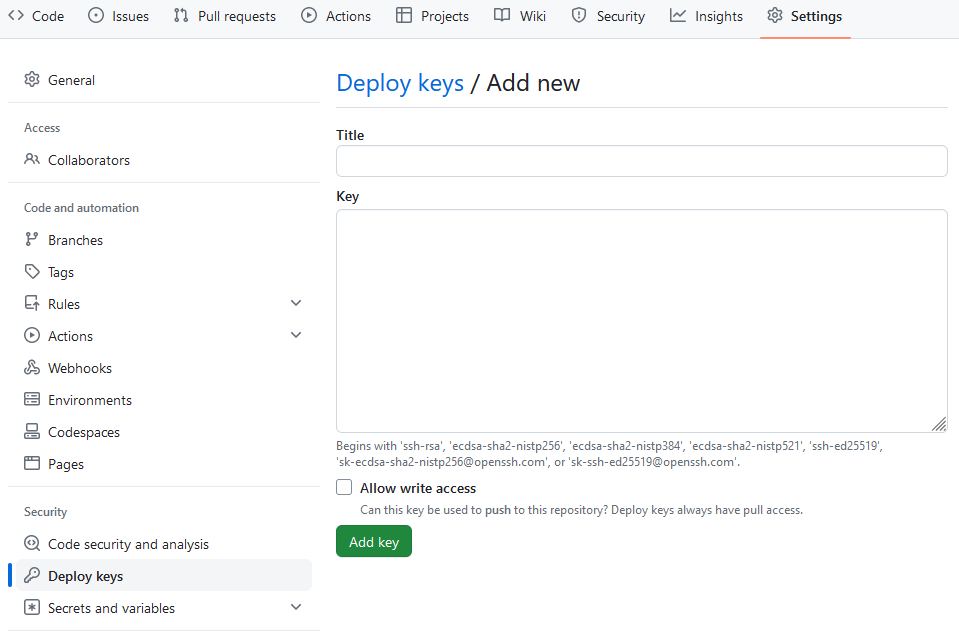

# Julkaisu yksityisestä GitHub-repositoriosta

Jotta palvelun julkaisu voidaan automatisoida, sen lähdekoodien on oltava Rahti-palvelun build-työkalujen luettavissa. 

Julkiseen GitHub-repositorioon lukuoikeus on kaikilla, siihen ei tarvita eri toimenpiteitä. Yksityisestä repositoriosta julkaisemista varten pitää lukuoikeus järjestää erikseen.

Julkaisua varten kannattaa luoda uusi SSH-avainpari juuri tätä projektia ja repositoriota varten. Henkilökohtaista SSH-avainta ei ole tarkoituksenmukaista käyttää julkaisuun, sillä julkaisuun tarvitaan yksityinen SSH-avain.

Luo sopivaan hakemistoon projektin ulkopuolella uusi avainpari. Salasanaa ei pidä määrittää.

```bash
ssh-keygen -C "rahti-build@repo-url" -f id_rahti_build -N=""
```

- `-C` lisää  avaintiedostoon kommentin, josta selviää, mikä avain on kyseessä, tässä `rahti-build@repo-url`
- `-f` määrittää tiedostonimen, tässä `id_rahti_build`
- `-N` määrittää, että ei käytetä salasanaa

Lisää julkinen avain GitHub-repositorioon GitHubin käyttöliittymässä. Esimerkissä luodussa avainparissa julkinen avain on tiedostossa nimeltä `id_rahti_build.pub`.



_Title_ on GitHubin käyttöliittymässä näkyvä nimi avaimelle. Julkaisuun ei tarvita kirjoitusoikeuksia. 

Lisää yksityinen SSH-avain projektiin luomalla sitä varten salaisuus. Esimerkissä salaisuuden nimi on  `github-secret` ja yksityinen avain on tiedostossa `id_rahti_build`.

```bash
oc create secret generic github-secret --from-file=ssh-privatekey=id_rahti_build --type=kubernetes.io/ssh-auth
```

Avainsalaisuus pitää vielä liittää Rahdin builder-palveluun
```bash
oc secrets link builder github-secret
```
