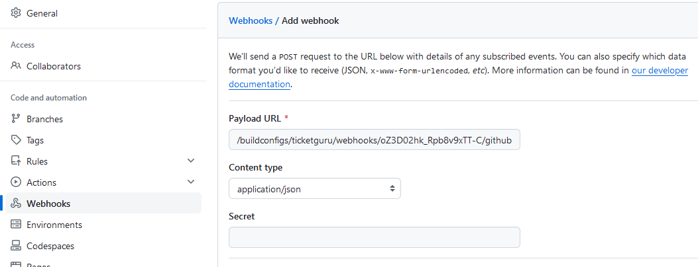

# React-sovelluksen julkaiseminen Rahti-ympäristössä

Tässä ohjeessa käydään läpi React-sovelluksen julkaisu Rahti-palvelussa. 

## Rahti-palvelun luonti
Luo ensin Rahti-projekti, asenna tarvittavat työkalut ja kirjaudu Rahti-palveluun ohjeiden mukaisesti

## React-sovelluksen valmistelu julkaisua varten

Julkaisu tehdään käyttäen Docker-konttia. Kontin levykuva tekee nesin React-buildin ja käynnistää sitten nginx-web-palvelimen jakamaan sovellusta.

Lisää projektin juureen Dockerfile-niminen tiedosto, jonka sisältö on seuraava:
```dockerfile
# Use an official Node runtime as a parent image
FROM node:19-alpine as build
# Set the working directory to /app
WORKDIR /app
# Copy the package.json and package-lock.json to the container
COPY package*.json ./
# Install dependencies
RUN npm ci
# Copy the rest of the application code to the container
COPY . .
# Build the React app
RUN npm run build

FROM nginx:alpine
# Support running as arbitrary user which belongs to the root group
# Note that users are not allowed to listen on privileged ports (< 1024)
RUN chmod g+rwx /var/cache/nginx /var/run /var/log/nginx && \
    chown nginx.root /var/cache/nginx /var/run /var/log/nginx && \
    # Make /etc/nginx/html/ available to use
    mkdir -p /etc/nginx/html/ && chmod 777 /etc/nginx/html/ && \
    # comment user directive as master process is run as user in OpenShift anyhow
    sed -i.bak 's/^user/#user/' /etc/nginx/nginx.conf
# Copy React build to nginx HTML directory 
COPY --from=build /app/<build-dir> /usr/share/nginx/html/

WORKDIR /usr/share/nginx/html/
EXPOSE 8080
USER nginx:root
```
- Yllä `<build-dir>` on hakemisto, johon React build tehtiin. 

Konfiguroi tiedostoon oikea build-hakemisto: Vite-ympäristössä hakemisto on oletusarvoisesti `dist`, Create React App -ympäristössä `build`

Lisää projektin juureen nginx-konfiguraatiotiedosto `nginx.conf` seuraavalla sisällöllä:
```nginx
server {
  listen 8080;
  root /usr/share/nginx/html;
  location / {
    index  index.html
    try_files $uri $uri/ /index.html;
  }
}
```

Voit testata Dockerfilen toimivuuden paikallisessa Docker-ympäristössä.

## Julkaisu

Jotta tässä luvussa käytettäviä `oc`-komentoja voi antaa, on ensin kirjauduttava Rahti-palveluun luvun [Rahti-palveluun kirjautuminen komentorivillä](#rahti-palveluun-kirjautuminen-komentorivilla) ohjeiden mukaisesti.

Jos repositorio on julkinen, voit luoda projektiin sovelluksen (_application_) komennolla:
```bash
oc new-app <repository-URL>#<branch-name>
```
- `<repository-URL>` on osoite, josta repositorion voi kloonata
- `<branch-name>` on haara, josta julkaistaan.

Jos repositorio on yksityinen, on komentoon lisättävä tieto käytettävästä SSH-avaimesta:

```bash
oc new-app <repository-URL>#<branch-name> --source-secret=<github-secret>
```
- `<github-secret>` on SSH-avaimen sisältävän salaisuuden nimi.

Tuloksena syntyy build config ja build käynnistyy. Voit seurata buildin etenemistä web-käyttöliittymässä.

Kun julkaisu on onnistunut, projektiin on ilmaantunut deployment-konfiguraatio sekä toivottavasti käynnissä oleva palvelu.

Kun palvelu on luotu. tarvitaan vielä reitti:

```bash
oc expose service <service-name>
```
- `<service-name>` on äsken luodun palvelun nimi, oletusarvoisesti sama kuin <deployment-config-name>

Tällä syntyy reittikin, ja palvelu on julkaistu verkkoon HTTP-protokollalla. Jos halutaan https-pääsy, on se konfiguroitava erikseen, ks. luku [HTTPS-konfigurointi](#https-konfigurointi)

## Buildin käynnistäminen

Julkaisun jälkeen uusi julkaisu voidaan käynnistää manuaalisesti web-käyttöliittymästä tai komentorivillä `oc`-komennolla.  
```bash
oc start-build <build-config-name>
```
- `<build-config-name>` on oletusarvoisesti sama kuin `<deployment-config-name>`

Build voidaan myös automatisoida tapahtumaan aina, kun GitHub-repositorioon pusketaan uusi versio lähdekoodista

## Buildin automatisointi

Jos sovellukselle on _build config_, jolla julkaisu tehdään GitHub-repositoriosta, voidaan build konfiguroida käynnistymään automaattisesti, kun repositorioon pusketaan uutta koodia.

Uusi build liipaistaan määrittämällä GitHub-repositorioon _webhook_, jota repositorio kutsuu aina, kun uusia muutoksia pusketaan.

Webhook-URL löytyy Rahti-palvelun käyttöliittymässä kohdata _Builds_.


Kopioi URL ja lisää se Github-repositorioon GitHubin web-käyttöliittymän kohdassa _Settings/Webhooks/Add webhook_.



Content type-asetuksen tulee olla `application/json`.

