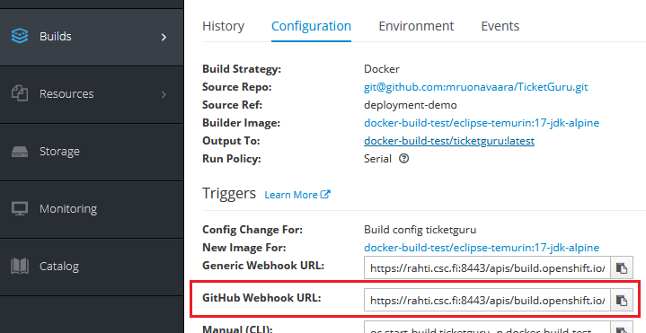
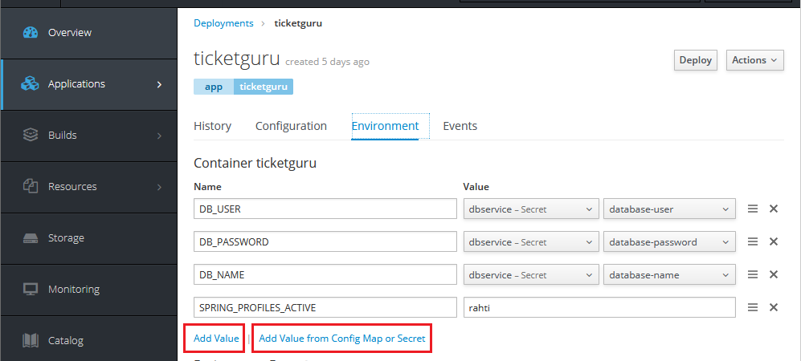
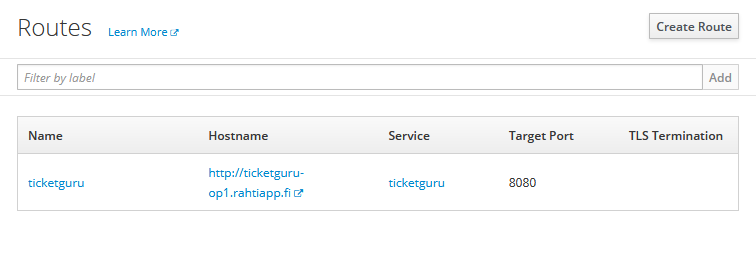
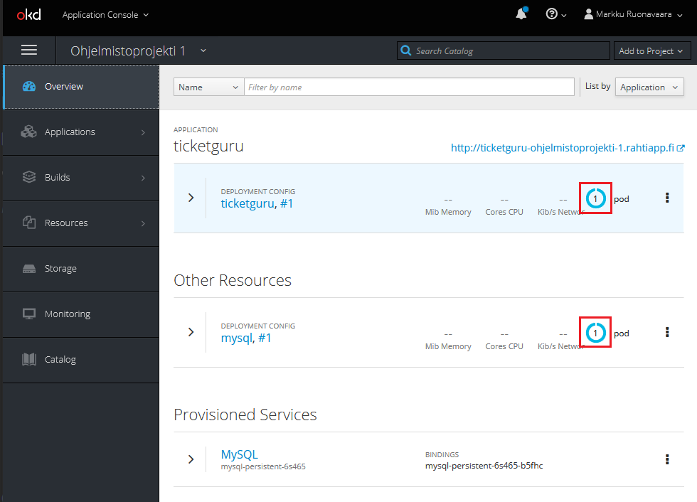

# Spring Boot -palvelun julkaiseminen Rahti-ympäristössä

## Johdanto

Tässä ohjeessa käydään läpi Spring-palvelun julkaisu Rahti-palvelussa. 

Oletuksena on, että julkaistavassa palvelussa on Spring-palvelin sekä relaatiotietokanta. Julkaisu tehdään seuraavassa esimerkissä vaiheittain:

1. Rahti-projektin luonti
2. Tietokantapalvelun luonti
3. Spring palvelimen julkaisu ilman ulkoista tietokantaa
4. Spring-palvelimen konfigurointi käyttämään ulkoista tietokantapalvelua


## Rahti-projektin luonti
```mermaid
flowchart LR
  classDef highlight fill:#ffe2ff,stroke:#996d99,stroke-width:3px;

  step1[Rahti-projektin luonti]
  step2[Tietokantapalvelun luonti]
  step3[Spring Boot -palvelimen julkaisu]
  step4[Tietokannan konfigurointi]

  step1:::highlight-->step2
  step2-->step3
  step3-->step4
```

Jotta Rahti-palvelua voi käyttää, pitää sen olla otettuna käyttöön MyCSC projektissa ja itse Rahti-palveluun pitää olla määriteltynä Rahti-projekti. 

Kirjaudu Rahti-palvelun web-käyttöliittymään osoitteessa <https://rahti.csc.fi:8443> CSC-tunnuksellasi. Kirjautumisen jälkeen palvelun etusivu näyttää tältä:


Lisää itsellesi Rahti-projekti painamalla ’Create Project’ painiketta näkymän oikeasta yläreunasta. Anna projektille kuvaava nimi.


MyCSC:n projektinäkymässä näkyvä projektinumero tulee mainita Rahti-projektin kuvauskentässä projektia luotaessa. Tällä mekanismilla palvelun käytöstä syntyneet kulut kohdennetaan määriteltyyn MyCSC projektiin.

Kirjaa projektinumero projektin kommenttikenttään seuraavasti:
```
csc_project:<projektinumero>
```
Korvaa _\<projektinumero>_ oman MyCSC projektisi numerosarjalla.

Kun painat _Create_, luodaan Rahti-projekti, johon voidaan määritellä tarvittavia palveluja ja resursseja.

### Jäsenten lisääminen Rahti-projektiin

Rahti-projektit ovat henkilökohtaisia, eivätkä ne oletusarvoisesti näy muille. Projektiin voidaan lisätä muita käyttäjiä heidän CSC-tunnuksillaan _Resources/Membership_-asetuksen kautta.


Voit Rahti-projektin omistajana näin lisätä projektitiimin jäsenet tai kurssin opettajan omaan projektiisi. 

### Openshift-komentorivityökalun asennus

Red Hat tarjoaa työkalun nimeltään `oc` OpenShift ympäristön hallintaan komentoriviltä käsin. Linkki `oc`-työkalun lataamiseen löytyy Rahti-palvelun hallintanäkymästä.


Linkistä avautuvalta sivustolta voi ladata omalle käyttöjärjestelmälle soveltuvan version. Linkeistä latautuu yksittäinen, suoritettava tiedosto nimeltään `oc`. Kyseisen tiedoston tulee löytyä käyttöjärjestelmän polusta (esim. Windows-ympäristön `PATH`-muuttujan määrittämässä sijainnissa) tai sen Spring-sovelluksen hakemistosta, mistä komentoja suoritetaan.

Jatkossa oletetaan, että `oc`-työkalu on asennettu polkuun. 

##### Asennus Windows-ympäristössä

Kopioi `oc.exe` johonkin hakemistoon koneellasi (esimerkissä `c:\openshift\CLI`) ja lisää hakemisto polkuun.

```powershell
$Path = [Environment]::GetEnvironmentVariable("PATH", "User") + [IO.Path]::PathSeparator + "C:\openshift\CLI"
[Environment]::SetEnvironmentVariable( "Path", $Path, "User" )
```

### Rahti-palveluun kirjautuminen komentorivillä

Jotta `oc`-komentoja voi antaa, on kirjauduttava Rahti-palveluun komentorivin kautta. 

Kirjautumiskomennon saa web käyttöliittymänäkymän oikeasta yläkulmasta _oma nimi_ ja sen alta avautuvasta valikosta _Copy Login Command_.


Liitä komento leikepöydältä paikallisen koneesi komentoriville ja suorita se projektin juurihakemistossa.  

Huom! Jos `oc`-komento ei ole polussa, voi olla tarpeen antaa komennonlle myös polku, esim.
```bash
./oc login https://rahti.csc.fi:8443 -token=...
```


## Tietokantapalvelun luominen
```mermaid
flowchart LR
  classDef highlight fill:#ffe2ff,stroke:#996d99,stroke-width:3px;

  step1[Rahti-projektin luonti]
  step2[Tietokantapalvelun luonti]
  step3[Spring Boot -palvelimen julkaisu]
  step4[Tietokannan konfigurointi]

  step1-->step2
  step2:::highlight-->step3
  step3-->step4
```

Rahti-projektiin voi lisätä esivalmisteltuja kontteja _Browse Catalog_-näkymästä:


Tässä esimerkissä käytetään MySQL-vaihtoehtoa. 

_Huom! Tarjolla olevat Ephemeral-versiot tietokantapalveluista käyttävät pelkästään väliaikaista tallennuskapasiteettia ja kaikki mahdolliset muutokset mm. tietokantaan häviävät samalla, kun kontin suoritus loppuu. Pysyvää tallennusta varten tulee valita "tavallinen" tietokantapalvelukontti ja sille dedikoitu Persistent Volume Claim (PVC) -tallennustila._

Etene luontivelhon näkymässä ’Next’ painikkeella konfigurointikohtaan ja täytä kontille haluamasi asetukset. Asetuksista kannattaa täydentää ainakin:

-	__Database Service Name__: Tietokantapalvelun nimi. Tällä nimellä muut kontit löytävät palvelun.
-	__MySQLConnection Username__: Käyttäjätunnus sql-palvelimelle kirjautumiseen.
-	__MySQL Connection Password__: Salasana sql-palvelimelle kirjautumiseen.
-	__MySQL Database Name__. Luotavan tietokannan nimi.


Luontivelho tarjoaa mahdollisuuden luoda tietokannan luonnin yhteydessä salaisuustiedosto (_secret_), johon talletetaan tietokannan konfiguraatiotiedot. 

Salaisuus kannattaa luoda, sillä sitä käyttäen luottamuksellisia konfiguraatiotietoja ei tarvitse tallettaa versionhallintaan, eikä niitä tarvitse lainkaan käsitellä suoraan vaan ne voidaan tarvittaessa lukea salaisuustiedostosta.


Salaisuudet (ja muut vastaavat resurssit) löytyvät Rahti-palvelun web-käyttöliittymästä _Resources_-valikon alta.


## Spring Boot -palvelimen julkaisu

```mermaid
flowchart LR
  classDef highlight fill:#ffe2ff,stroke:#996d99,stroke-width:3px;

  step1[Rahti-projektin luonti]
  step2[Tietokantapalvelun luonti]
  step3[Spring Boot -palvelimen julkaisu]
  step4[Tietokannan konfigurointi]

  step1-->step2
  step2-->step3
  step3:::highlight-->step4
```

Seuraavassa käydään läpi Spring Boot -palvelimen julkaisu ilman ulkoista tietokantaa.

Tietokannan konfigurointi käsitellään seuraavassa luvussa.

__Huom!__ Jotta tässä luvussa käytettäviä `oc`-komentoja voi antaa, on ensin kirjauduttava Rahti-palveluun luvun [Rahti-palveluun kirjautuminen komentorivillä](#rahti-palveluun-kirjautuminen-komentorivilla) ohjeiden mukaisesti.

### Julkaisu yksityisestä GitHub-repositoriosta

Jotta palvelun julkaisu voidaan automatisoida, sen lähdekoodien on oltava Rahti-palvelun build-työkalujen luettavissa. 

Julkiseen GitHub-repositorioon lukuoikeus on kaikilla, siihen ei tarvita eri toimenpiteitä. Yksityisestä repositoriosta julkaisemista varten pitää lukuoikeus järjestää erikseen.

Julkaisua varten kannattaa luoda uusi SSH-avainpari juuri tätä projektia ja repositoriota varten. Henkilökohtaista SSH-avainta ei oel tarkoituksenmukaista käyttää julkaisuun, sillä julkaisuun tarvitaan yksityinen SSH-avain.

Luo sopivaan hakemistoon projektin ulkopuolella uusi avainpari. Salasanaa ei pidä määrittää.

```bash
ssh-keygen -C "rahti-build@repo-url" -f id_rahti_build -N=""
```
- `-C` lisää  avaintiedostoon kommentin, josta selviää, mikä avain on kyseessä, tässä `rahti-build@repo-url`
- `-f` määrittää tiedostonimen, tässä `id_rahti_build`
- `-N` määrittää, että ei käytetä salasanaa

Lisää julkinen avain GitHub-repositorioon GitHubin käyttöliittymässä. Esimerkissä luodussa avainparissa julkinen avain on tiedostossa nimeltä `id_rahti_build.pub`.


_Title_ on GitHubin käyttöliittymässä näkyvä nimi avaimelle. Julkaisuun ei tarvita kirjoitusoikeuksia. 

Lisää yksityinen SSH-avain projektiin luomalla sitä varten salaisuus. Esimerkissä salaisuuden nimi on  `github-secret` ja yksityinen avain on tiedostossa `id_rahti_build`.

```bash
oc create secret generic github-secret --from-file=ssh-privatekey=id_rahti_build --type=kubernetes.io/ssh-auth
```

Avainsalaisuus pitää vielä liittää Rahdin builder-palveluun
```bash
oc secrets link builder github-secret
```

### Sovelluksen luonti

Rahti-palvelun työkaluilla voidaan luoda sovelluksen julkaisuun tarvittavat resurssit repositorion sisällön automaattisesti. Resurssit voidaan luoda joko suoraan lähdekoodin perusteella (_Source-to_Image_, _S2I_) tai projektissa määritetyn Dockerfile:n perusteella. 

Seuraavissa esimerkeissä käydään läpi sovelluksen julkaisu molemmilla tavoilla. Kaikki komennot tehdään komentoriviltä. 

Kirjaudu ensin Rahti-palveluun komentorivillä ja aseta luomasi projekti aktiiviseksi.

```bash
oc project myproject
```

#### Repositorio-oikeudet

Rahti-työkalut tarvitsevat pääsyn projektin repositorioon. Jos repositorio on julkinen, ei pääsyoikeuksia tarvitse erikseen määrittää.

Jos repositorio on yksityinen, on Rahti-projektille järjestettävä pääsy luvun [Julkaisu yksityisestä GitHub-repositoriosta](#julkaisu-yksityisestä-github-repositoriosta) ohjeiden mukaisesti, ja annettavissa komennoissa on lisäksi annettava  tieto tarvittavasta SSH-avaimesta valitsimella 

```bash
--source-secret=<github-creds-secret-name>
```

- `<github-creds-secret-name>` on salaisuus, joka sisältää yksityisen SSH-avaimen.

Tässä tapauksessa repositorion osoite pitää antaa SSH-muodossa, esim:

```bash
git@github.com:<user>/<repositorionimi>.git
```


#### Sovelluksen luonti Source-to-Image-työkaluilla

Jos repositorio on julkinen, voit luoda projektiin sovelluksen (_application_) komennolla:

```
oc new-app registry.access.redhat.com/ubi8/openjdk-17:1.18-2~<repository-URL>#<branch-name>
```
- `registry.access.redhat.com/ubi8/openjdk-17:1.18-2` on S2I-työkalulevykuva Java 17-sovelluksille
- `<repositorio-URL>` on osoite, josta repositorion voi kloonata
- `<branch-name>` on haara, josta julkaistaan.

Jos repositorio on yksityinen, on komentoon lisättävä tieto käytettävästä SSH-avaimesta:
```
oc new-app registry.access.redhat.com/ubi8/openjdk-17:1.18-2~<repository-URL>#<branch-name> --source-secret=<github-creds-secret-name>
```
Tuloksena syntyy build config ja build käynnistyy. Voit seurata buildin etenemistä web-käyttöliittymässä.

Kun julkaisu on onnistunut, projektiin on ilmaantunut deployment-konfiguraatio sekä toivottavasti käynnissä oleva palvelu. 

Tämän jälkeen on vielä avattava palvelulle reitti (_route_), jolla palveluun pääsee internetistä. Sen voi tehdä komennolla:

```bash
oc expose service <service-name>
```
- `<service-name>` on palvelun nimi

Oletusarvoisesti luodaan salaamaton http-reitti. Jos halutaan https-pääsy, on se konfiguroitava erikseen, ks. luku [HTTPS-konfigurointi](#https-konfigurointi)

#### Sovelluksen luonti Dockerfilen perusteella

Lisää Spring Boot projektin juureen tiedosto `Dockerfile`, jonka sisältö on seuraava:
```dockerfile
FROM eclipse-temurin:17-jdk-focal as builder
WORKDIR /opt/app
COPY .mvn/ .mvn
COPY mvnw pom.xml ./
RUN chmod +x ./mvnw
RUN ./mvnw dependency:go-offline
COPY ./src ./src
RUN ./mvnw clean install -DskipTests 
RUN find ./target -type f -name '*.jar' -exec cp {} /opt/app/app.jar \; -quit

FROM eclipse-temurin:17-jre-alpine
COPY --from=builder /opt/app/*.jar /opt/app/
EXPOSE 8080
ENTRYPOINT ["java", "-jar", "/opt/app/app.jar" ]
``` 
Määritys on laadittu yleiskäyttöiseksi, sen pitäisi toimia missä tahansa Spring Boot -projektissa sellaisenaan.

Jos repositorio on julkinen, voit luoda projektiin sovelluksen (_application_) komennolla:
```bash
oc new-app <repository-URL>#<branch-name>
```
- `<repository-URL>` on osoite, josta repositorion voi kloonata
- `<branch-name>` on haara, josta julkaistaan.

Jos repositorio on yksityinen, on komentoon lisättävä tieto käytettävästä SSH-avaimesta:

```bash
oc new-app <repository-URL>#<branch-name> --source-secret=github-ticketguru
```

Tuloksena syntyy build config ja build käynnistyy. Voit seurata buildin etenemistä web-käyttöliittymässä.

Kun julkaisu on onnistunut, projektiin on ilmaantunut deployment-konfiguraatio (_deployment configuration_), palvelu (_service_) sekä toivottavasti käynnissä oleva kontti.

Kun service on luotu. tarvitaan vielä reitti:

```bash
oc expose service <service-name>
```
- `<service-name>` on äsken luodun palvelun nimi, oletusarvoisesti sama kuin sovelluksen nimi. Sovelluksen palvelut voi katsoa web-käyttöliittymästä tai listata komennolla `oc get svc`.

Tällä syntyy reittikin, ja palvelu on julkaistu verkkoon HTTP-protokollalla. Jos halutaan https-pääsy, on se konfiguroitava erikseen, ks. luku [HTTPS-konfigurointi](#https-konfigurointi)

### Julkaisu paikallisesta hakemistosta JKube OpenShift Maven pluginilla

Eclipse JKube on kokoelma lisäosia ja kirjastoja, joiden avulla helpotetaan Java-ohjelmistojen kontittamista ja julkaisua OpenShift konttipalveluun. JKube OpenShift Maven pluginilla voidaan julkaista sovellus kehitysympäristöstä suoraan paikallisesta hakemistosta (siis ei GitHub-repositoriosta). 

Tätä julkaisua ei voi samalla tavoin automatisoida kuin GitHubista tehtäviä julkaisuja.

Lisäosan käyttöönotto on suoraviivaista: Lisää Spring Boot projektin pom.xml tiedostoon JKube-lisäosan määritys:

```xml
<build>
	<plugins>

		<plugin>
			<groupId>org.eclipse.jkube</groupId>
			<artifactId>openshift-maven-plugin</artifactId>
		</plugin>

	</plugins>
</build>
```

Kirjaudu rahti-palveluun komentorivin kautta.Tämän jälkeen julkaisu voidaan tehdä maven -komennolla:

``` bash
./mvnw package oc:build oc:resource oc:apply
```
Komento valmistelee Java projektin, luo ja alustaa OpenShift ympäristöön soveltuvan kontin ja lataa kontin suoritukseen OpenShift ympäristöön.

Komennon päättymisen jälkeen Rahti-projektin Overview-näkymästä voit saada tietoa julkaisun tilasta ja onnistumisesta, sekä löydät julkaistun palvelun URL-osoitteen.


### Buildin käynnistäminen

Julkaisun jälkeen uusi julkaisu voidaan käynnistää manuaalisesti web-käyttöliittymästä tai komentorivillä `oc`-komennolla.  
```bash
oc start-build <build-config-name>
```
- `<build-config-name>` on oletusarvoisesti sama kuin `<deployment-config-name>`

Build voidaan myös automatisoida tapahtumaan aina, kun GitHub-repositorioon pusketaan uusi versio lähdekoodista

### Buildin automatisointi

Jos sovellukselle on _build config_, jolla julkaisu tehdään GitHub-repositoriosta, voidaan build konfiguroida käynnistymään automaattisesti, kun repositorioon pusketaan uutta koodia.

Uusi build liipaistaan määrittämällä GitHub-repositorioon _webhook_, jota repositorio kutsuu aina, kun uusia muutoksia pusketaan.

Webhook-URL löytyy Rahti-palvelun käyttöliittymässä kohdata _Builds_.



Kopioi URL ja lisää se Github-repositorioon GitHubin web-käyttöliittymän kohdassa _Settings/Webhooks/Add webhook_.


Content type-asetuksen tulee olla `application/json`.

## Spring Boot -palvelimen konfigurointi käyttämään ulkoista tietokantapalvelua

```mermaid
flowchart LR
  classDef highlight fill:#ffe2ff,stroke:#996d99,stroke-width:3px;

  step1[Rahti-projektin luonti]
  step2[Tietokantapalvelun luonti]
  step3[Spring Boot -palvelimen julkaisu]
  step4[Tietokannan konfigurointi]

  step1-->step2
  step2-->step3
  step3-->step4:::highlight
```

Seuraavassa esimerkissä konfiguroidaan Spring Boot -palvelin käyttämään projektiin luotua tietokantapalvelua.

Esimerkissä palvelimessa käytettävän tietokannan asetukset hallitaan käyttämällä Spring-profiileja: tietokantakonfiguraatiota varten määritellään oma profiili, joka määritellään käyttöön julkaisuympäriristössä.

### Julkaisuprofiilin luonti Spring-projektiin

Profiili voidaan määritellä laatimalla projektiin profiilikohtainen `application.properties`-määritys. Sen nimeksi tulee asettaa `application-<profiilinimi>.properties`. Jos esimerkiksi profiilin nimeksi valitaan `rahti`, tiedoston nimi on `application-rahti.properties`.

Profiilikohtaiset asetukset luetaan globaalien asetusten lisäksi. Näin esim. julkaisukonfiguraatioparametrit voidaan määritellä jokaista julkaisuympäristöä varten eri tiedostoihin.

Seuraavassa esimerkissä käytetään palvelimen ajoympäristöstä luettavia ympäristömuuttuja-arvoja. Näin julkaisuympäristön konfiguraatioparametreja ei tarvitse viedä versionhallintaan.

Rahti-projektiin luotavat kontit saavat projektiin luodun tietokantapalvelun tiedot ajoympäristöön määritetyistä ympäristömuuttujista, joiden nimi muodostetaan tietokantapalvelun nimen perusteella seuraavasti:
``` { .yaml .no-copy }
  <tietokantapalvelun nimi>_SERVICE_HOST
  <tietokantapalvelun nimi>_SERVICE_PORT
```  

Voit avata kontin Terminal-näkymän ja tarkastella ympäristömuuttujia `env` komennolla. Alla olevassa kuvassa ympäristömuuttujista on listattu muuttujat, jotka kertovat tietokantapalvelun, jonka nimi on `mysql-service`, tiedot muille Rahti-projektin konteille.


Esimerkki profiilimääritystiedoston sisällöstä, jos tietokantapalvelun nimeksi on asetettu `db-service`:
```
spring.datasource.url=jdbc:mysql://${DB_SERVICE_SERVICE_HOST}:${DB_SERVICE_SERVICE_PORT}/${DB_NAME}
spring.datasource.username=${DB_USER}
spring.datasource.password=${DB_PASSWORD}
spring.jpa.show-sql=true
spring.jpa.generate-ddl=true
spring.jpa.hibernate.ddl-auto=update
```

Huom: Tietokantapalvelinta kytkettäessä muihin kontteihin, on tärkeää käyttää muuttujanimiä eikä esim. IP-osoitetta suoraan. IP-osoitteet voivat muuttua esimerkiksi kontin uudelleen käynnistymisen yhteydessä

### Ympäristömuuttujien asettaminen

Profiiliin määritellyt ympäristömuuttujat pitää vielä asettaa. Voit määritellä käynnistettävälle kontille ympäristömuuttujia Rahti-palvelun web-käyttöliittymässä kohdassa _Applications/Deployments_:



Ympäristömuuttujan arvon voidaan määritellä suoraan tai valita sen jostain projektiin luodusta salaisuudesta. 

Ylläolevassa esimerkissä MySQL-tietokannan tietokantakäyttäjän nimi `DB_USER` ja salasana `DB_PASSWORD` sekä tietokannan nimi `DB_NAME` luetaan salaisuudesta, joka luotiin tietokantapalvelun lisäämisen yhteydessä. Aktiivisen profiilin asettavan ympäristömuuttujan arvo `SPRING_PROFILES_ACTIVE` annetaan suoraan.

Kun julkaisu seuraavan kerran tehdään, käynnistyvässä kontissa ympäristömuuttujat on määritelty.

### Ympäristömuuttujien asettaminen JKube OpenShift Maven pluginia käytettäessä

Koska OpenShift Maven plugin yliajaa kaikki web-käyttöliittymässä tehdyt konttiasetukset, on sitä käytettäessä määritykset tehtävä pluginin määritystiedostossa.

Tarkista Rahti-palvelun hallintakäyttöliittymästä tietokannan luonnin yhteydessä luodun salaisuuden nimi. Tässä esimerkissä se on `mysql-secret`. 

Lisää Spring sovelluksen hakemistorakenteeseen `src/main/jkube` tiedosto nimeltään `deployment.yml`.
```
spec:
  template:
    spec:
      containers:
        - env:
            - name: MYSQL_USER
              valueFrom:
                secretKeyRef:
                  key: database-user
                  name: mysql-secret
            - name: MYSQL_PASSWORD
              valueFrom:
                secretKeyRef:
                  key: database-password
                  name: mysql-secret
            - name: MYSQL_DATABASE
              valueFrom:
                secretKeyRef:
                  key: database-name
                  name: mysql-secret
            - name: SPRING_PROFILES_ACTIVE
              value: rahti
```

Parametrien selitykset:
- `name` on asetettavan ympäristömuuttujan nimi
- `valueFrom.secretKeyRef.name` määrittää, minkä nimisestä salaisuudesta arvo luetaan. Vaihda tähän omasta ympäristöstäsi oikea salaisuuden nimi.
- `valueFrom.secretKeyRef.key` määrittää, mistä salaisuuden kentästä arvo luetaan.
- Lopuksi asetaan ympäristömuuttujan SPRING_PROFILES_ACTIVE arvoksi halutun profiilin nimi. Käytettävä Spring-profiili voidaan asettaa ympäristömuuttujalla SPRING_PROFILES_ACTIVE.

Huomaa, että tiedostomuoto on YAML. Sen rakenteeseen on tarvittaessa hyvä hakea vinkkiä web-käyttöliittymästä valitsemalla tietokantapodin valikosta _Edit YAML_.

Suorita uudelleen komento 
```
 ./mvnw package oc:build oc:resource oc:apply
```
Rahti-projektin _Overview_-näkymässä voi seurata julkaisun etenemistä. Onnistuneen julkaisun jälkeen näkymässä näkyy, että sekä sovelluspalvelinkontti(Spring Boot-palvelin) että tietokantapalvelinkontti ovat käynnissä.


## HTTPS-konfigurointi

Julkaistu palvelu tarjotaan oletusarvoisesti vain HTTP-protokollalla. Palvelu voidaan konfiguroida tarjottavaksi myös HTTPS-protokollalla tai pelkästään HTTPS-protokollalla.

Konfiguroinnin voi tehdä komentorivillä komennolla 
```bash
oc create route edge --service=<service-name>
``` 

Jos olet jo luonut suojaamattoman reitin eikä komento siksi onnistu, voit poistaa vanhan reitin komennolla 
```bash
oc delete route <route-name>
```
- `<route-name>` on reitin nimi. Reitin nimi on oletusarvoisesti sama kuin palvelun nimi. Voit listata olemassaolevat reitit komennolla `oc get route`.

Web-käyttöliittymässä määritys tehdään Rahti-sovelluksen Route-määrittelyssä.




Reitille voidaan konfiguroida TLS käyttöön. Jos sertifikaatin jättää määrittämättä, käytetään oletussertifikaattia. HTTP-liikenteen voi joko sallia, estää tai uudelleenohjata.


Lisätietoa: [Rahti Docs: Networking](https://docs.csc.fi/cloud/rahti/networking/)

## Virheenjäljitys

Käynnissä olevien konttien (_pod_) tietoja voidaan tarkastella Rahti-palvelun hallintaliittymässä.

Käynnissä olevat kontit löytyvät helposti Overview-näkymästä.



Lokeja voi tarkastella välilehdellä _Logs_:


Konttiin saa pääteyhteyden välilehdellä _Terminal_:


Konttiin saa ssh-yhteyden myös komentorivillä komennolla `oc rsh <nimi>`. Projektin kontit voi listata komennolla `oc get pods`.

```bash
PS > oc get pods
NAME                  READY     STATUS      RESTARTS   AGE
dbservice-1-p2smq     1/1       Running     0          4h
ticketguru-11-sbqhn   1/1       Running     0          1h
PS > oc rsh ticketguru-11-sbqhn
~ $ 
```

Tietokantaa voi tarkastella tietokantajärjestelmän komentorivityökaluilla tietokantakontin pääteyhteydellä, esim. 
```bash
$ mysql -u dbuser -p dbname
```

## Projektin uudelleenluonti

Jos sovelluksen luonti `oc new-app`-komennolla jostain syystä ei onnistu, komennon uudelleenyrittäminen voi olla hankalaa, koska joitakin resursseja on jo luotu.
 
Helpointa saattaa olla poistaa koko Rahti-projekti ja luoda se alusta saakka uudelleen komentorivikomennnoin.

Seuraavissa esimerkeissä poistettavan ja uudelleen luotavan projektin nimi on `myproj`.
```
oc delete project myproj
oc new-project myproj --description='csc_project:200xxxx'
```
-  `xxxx` korvataan oman CSC-projektin tunnisteen neljällä viimeisellä numerolla


