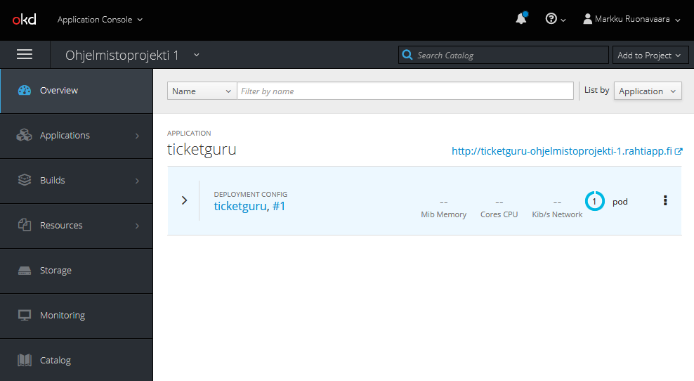

## Julkaisu paikallisesta hakemistosta JKube OpenShift Maven pluginilla

Eclipse JKube on kokoelma lisäosia ja kirjastoja, joiden avulla helpotetaan Java-ohjelmistojen kontittamista ja julkaisua OpenShift konttipalveluun. JKube OpenShift Maven pluginilla voidaan julkaista sovellus kehitysympäristöstä suoraan paikallisesta hakemistosta (siis ei GitHub-repositoriosta). 

Tätä julkaisua ei voi samalla tavoin automatisoida kuin GitHubista tehtäviä julkaisuja.

Lisäosan käyttöönotto on suoraviivaista: Lisää Spring Boot projektin pom.xml tiedostoon JKube-lisäosan määritys:

```xml
<build>
	<plugins>

		<plugin>
			<groupId>org.eclipse.jkube</groupId>
			<artifactId>openshift-maven-plugin</artifactId>
		</plugin>

	</plugins>
</build>
```

Kirjaudu rahti-palveluun komentorivin kautta.Tämän jälkeen julkaisu voidaan tehdä maven -komennolla:

``` bash
./mvnw package oc:build oc:resource oc:apply
```
Komento valmistelee Java projektin, luo ja alustaa OpenShift ympäristöön soveltuvan kontin ja lataa kontin suoritukseen OpenShift ympäristöön.

Komennon päättymisen jälkeen Rahti-projektin Overview-näkymästä voit saada tietoa julkaisun tilasta ja onnistumisesta, sekä löydät julkaistun palvelun URL-osoitteen.



### Ympäristömuuttujien asettaminen JKube OpenShift Maven pluginia käytettäessä

Koska OpenShift Maven plugin yliajaa kaikki web-käyttöliittymässä tehdyt konttiasetukset, on sitä käytettäessä määritykset tehtävä pluginin määritystiedostossa.

Tarkista Rahti-palvelun hallintakäyttöliittymästä tietokannan luonnin yhteydessä luodun salaisuuden nimi. Tässä esimerkissä se on `mysql-secret`. 

Lisää Spring sovelluksen hakemistorakenteeseen `src/main/jkube` tiedosto nimeltään `deployment.yml`.
```
spec:
  template:
    spec:
      containers:
        - env:
            - name: MYSQL_USER
              valueFrom:
                secretKeyRef:
                  key: database-user
                  name: mysql-secret
            - name: MYSQL_PASSWORD
              valueFrom:
                secretKeyRef:
                  key: database-password
                  name: mysql-secret
            - name: MYSQL_DATABASE
              valueFrom:
                secretKeyRef:
                  key: database-name
                  name: mysql-secret
            - name: SPRING_PROFILES_ACTIVE
              value: rahti
```

Parametrien selitykset:
- `name` on asetettavan ympäristömuuttujan nimi
- `valueFrom.secretKeyRef.name` määrittää, minkä nimisestä salaisuudesta arvo luetaan. Vaihda tähän omasta ympäristöstäsi oikea salaisuuden nimi.
- `valueFrom.secretKeyRef.key` määrittää, mistä salaisuuden kentästä arvo luetaan.
- Lopuksi asetaan ympäristömuuttujan SPRING_PROFILES_ACTIVE arvoksi halutun profiilin nimi. Käytettävä Spring-profiili voidaan asettaa ympäristömuuttujalla SPRING_PROFILES_ACTIVE.

Huomaa, että tiedostomuoto on YAML. Sen rakenteeseen on tarvittaessa hyvä hakea vinkkiä web-käyttöliittymästä valitsemalla tietokantapodin valikosta _Edit YAML_.

Suorita uudelleen komento 
```
 ./mvnw package oc:build oc:resource oc:apply
```
Rahti-projektin _Overview_-näkymässä voi seurata julkaisun etenemistä. Onnistuneen julkaisun jälkeen näkymässä näkyy, että sekä sovelluspalvelinkontti(Spring Boot-palvelin) että tietokantapalvelinkontti ovat käynnissä.


