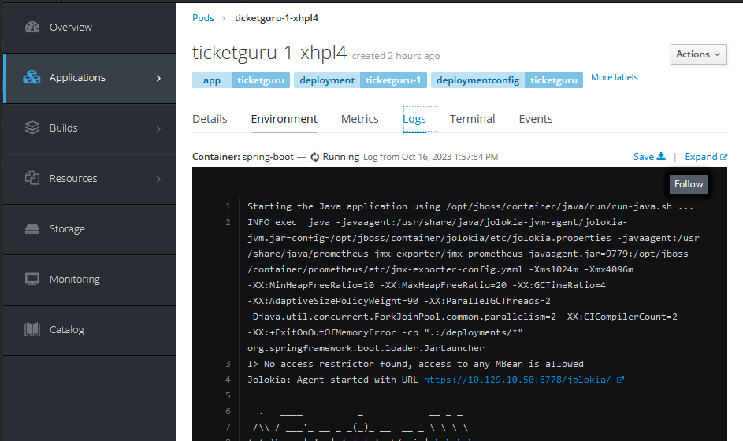
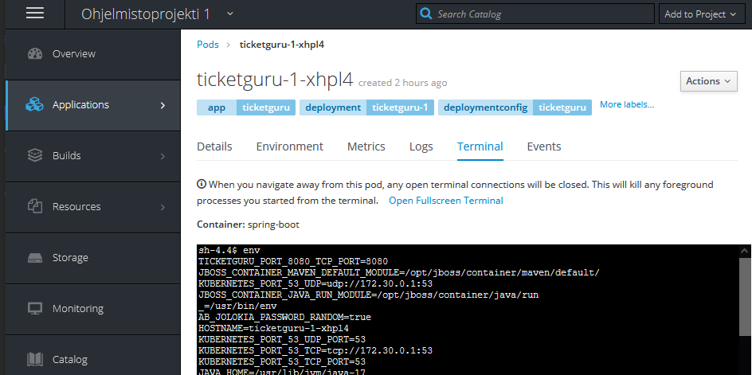

# Rahti-palvelun yleiset ohjeet

## Rahti-projektin luonti

Jotta Rahti-palvelua voi käyttää, pitää sen olla otettuna käyttöön MyCSC projektissa ja itse Rahti-palveluun pitää olla määriteltynä Rahti-projekti. 

Kirjaudu Rahti-palvelun web-käyttöliittymään osoitteessa <https://rahti.csc.fi:8443> CSC-tunnuksellasi. Kirjautumisen jälkeen palvelun etusivu näyttää tältä:


Lisää itsellesi Rahti-projekti painamalla ’Create Project’ painiketta näkymän oikeasta yläreunasta. Anna projektille kuvaava nimi.


MyCSC:n projektinäkymässä näkyvä projektinumero tulee mainita Rahti-projektin kuvauskentässä projektia luotaessa. Tällä mekanismilla palvelun käytöstä syntyneet kulut kohdennetaan määriteltyyn MyCSC projektiin.

Kirjaa projektinumero projektin kommenttikenttään seuraavasti:
```
csc_project:<projektinumero>
```
Korvaa _\<projektinumero>_ oman MyCSC projektisi numerosarjalla.

Kun painat _Create_, luodaan Rahti-projekti, johon voidaan määritellä tarvittavia palveluja ja resursseja.

### Jäsenten lisääminen Rahti-projektiin

Rahti-projektit ovat henkilökohtaisia, eivätkä ne oletusarvoisesti näy muille. Projektiin voidaan lisätä muita käyttäjiä heidän CSC-tunnuksillaan _Resources/Membership_-asetuksen kautta.


Voit Rahti-projektin omistajana näin lisätä projektitiimin jäsenet tai kurssin opettajan omaan projektiisi. 

## Openshift-komentorivityökalun asennus

Red Hat tarjoaa työkalun nimeltään `oc` OpenShift ympäristön hallintaan komentoriviltä käsin. Linkki `oc`-työkalun lataamiseen löytyy Rahti-palvelun hallintanäkymästä.


Linkistä avautuvalta sivustolta voi ladata omalle käyttöjärjestelmälle soveltuvan version. Linkeistä latautuu yksittäinen, suoritettava tiedosto nimeltään `oc`. Kyseisen tiedoston tulee löytyä käyttöjärjestelmän polusta (esim. Windows-ympäristön `PATH`-muuttujan määrittämässä sijainnissa) tai sen Spring-sovelluksen hakemistosta, mistä komentoja suoritetaan.

Jatkossa oletetaan, että `oc`-työkalu on asennettu polkuun. 

### Asennus Windows-ympäristössä

Kopioi `oc.exe` johonkin hakemistoon koneellasi (esimerkissä `c:\openshift\CLI`) ja lisää hakemisto polkuun.

```powershell
$Path = [Environment]::GetEnvironmentVariable("PATH", "User") + [IO.Path]::PathSeparator + "C:\openshift\CLI"
[Environment]::SetEnvironmentVariable( "Path", $Path, "User" )
```

## Rahti-palveluun kirjautuminen komentorivillä

Jotta `oc`-komentoja voi antaa, on kirjauduttava Rahti-palveluun komentorivin kautta. 

Kirjautumiskomennon saa web käyttöliittymänäkymän oikeasta yläkulmasta _oma nimi_ ja sen alta avautuvasta valikosta _Copy Login Command_.


Liitä komento leikepöydältä paikallisen koneesi komentoriville ja suorita se projektin juurihakemistossa.  

Huom! Jos `oc`-komento ei ole polussa, voi olla tarpeen antaa komennonlle myös polku, esim.
```bash
./oc login https://rahti.csc.fi:8443 -token=...
```

## Tietokantapalvelun luominen

Rahti-projektiin voi lisätä esivalmisteltuja kontteja _Browse Catalog_-näkymästä:


Tässä esimerkissä käytetään MySQL-vaihtoehtoa. 

_Huom! Tarjolla olevat Ephemeral-versiot tietokantapalveluista käyttävät pelkästään väliaikaista tallennuskapasiteettia ja kaikki mahdolliset muutokset mm. tietokantaan häviävät samalla, kun kontin suoritus loppuu. Pysyvää tallennusta varten tulee valita "tavallinen" tietokantapalvelukontti ja sille dedikoitu Persistent Volume Claim (PVC) -tallennustila._

Etene luontivelhon näkymässä ’Next’ painikkeella konfigurointikohtaan ja täytä kontille haluamasi asetukset. Asetuksista kannattaa täydentää ainakin:

-	__Database Service Name__: Tietokantapalvelun nimi. Tällä nimellä muut kontit löytävät palvelun.
-	__MySQLConnection Username__: Käyttäjätunnus sql-palvelimelle kirjautumiseen.
-	__MySQL Connection Password__: Salasana sql-palvelimelle kirjautumiseen.
-	__MySQL Database Name__. Luotavan tietokannan nimi.


Luontivelho tarjoaa mahdollisuuden luoda tietokannan luonnin yhteydessä salaisuustiedosto (_secret_), johon talletetaan tietokannan konfiguraatiotiedot. 

Salaisuus kannattaa luoda, sillä sitä käyttäen luottamuksellisia konfiguraatiotietoja ei tarvitse tallettaa versionhallintaan, eikä niitä tarvitse lainkaan käsitellä suoraan vaan ne voidaan tarvittaessa lukea salaisuustiedostosta.


Salaisuudet (ja muut vastaavat resurssit) löytyvät Rahti-palvelun web-käyttöliittymästä _Resources_-valikon alta.


## HTTPS-konfigurointi

Julkaistu palvelu tarjotaan oletusarvoisesti vain HTTP-protokollalla. Palvelu voidaan konfiguroida tarjottavaksi myös HTTPS-protokollalla tai pelkästään HTTPS-protokollalla.

Konfiguroinnin voi tehdä komentorivillä komennolla 
```bash
oc create route edge --service=<service-name>
``` 

Jos olet jo luonut suojaamattoman reitin eikä komento siksi onnistu, voit poistaa vanhan reitin komennolla 
```bash
oc delete route <route-name>
```
- `<route-name>` on reitin nimi. Reitin nimi on oletusarvoisesti sama kuin palvelun nimi. Voit listata olemassaolevat reitit komennolla `oc get route`.

Web-käyttöliittymässä määritys tehdään Rahti-sovelluksen Route-määrittelyssä.


Reitille voidaan konfiguroida TLS käyttöön. Jos sertifikaatin jättää määrittämättä, käytetään oletussertifikaattia. HTTP-liikenteen voi joko sallia, estää tai uudelleenohjata.


Lisätietoa: [Rahti Docs: Networking](https://docs.csc.fi/cloud/rahti/networking/)


## Virheenjäljitys

Käynnissä olevien konttien (_pod_) tietoja voidaan tarkastella Rahti-palvelun hallintaliittymässä.

Käynnissä olevat kontit löytyvät helposti Overview-näkymästä.


Lokeja voi tarkastella välilehdellä _Logs_:



Konttiin saa pääteyhteyden välilehdellä _Terminal_:



Konttiin saa ssh-yhteyden myös komentorivillä komennolla `oc rsh <nimi>`. Projektin kontit voi listata komennolla `oc get pods`.

```bash
PS > oc get pods
NAME                  READY     STATUS      RESTARTS   AGE
dbservice-1-p2smq     1/1       Running     0          4h
ticketguru-11-sbqhn   1/1       Running     0          1h
PS > oc rsh ticketguru-11-sbqhn
~ $ 
```

Tietokantaa voi tarkastella tietokantajärjestelmän komentorivityökaluilla tietokantakontin pääteyhteydellä, esim. 
```bash
$ mysql -u dbuser -p dbname
```

## Projektin uudelleenluonti

Jos sovelluksen luonti `oc new-app`-komennolla jostain syystä ei onnistu, komennon uudelleenyrittäminen voi olla hankalaa, koska joitakin resursseja on jo luotu.
 
Helpointa saattaa olla poistaa koko Rahti-projekti ja luoda se alusta saakka uudelleen komentorivikomennnoin.

Seuraavissa esimerkeissä poistettavan ja uudelleen luotavan projektin nimi on `myproj`.
```
oc delete project myproj
oc new-project myproj --description='csc_project:200xxxx'
```
-  `xxxx` korvataan oman CSC-projektin tunnisteen neljällä viimeisellä numerolla


## Julkaisu yksityisestä GitHub-repositoriosta

Jotta palvelun julkaisu voidaan automatisoida, sen lähdekoodien on oltava Rahti-palvelun build-työkalujen luettavissa. 

Julkiseen GitHub-repositorioon lukuoikeus on kaikilla, siihen ei tarvita eri toimenpiteitä. Yksityisestä repositoriosta julkaisemista varten pitää lukuoikeus järjestää erikseen.

Julkaisua varten kannattaa luoda uusi SSH-avainpari juuri tätä projektia ja repositoriota varten. Henkilökohtaista SSH-avainta ei ole tarkoituksenmukaista käyttää julkaisuun, sillä julkaisuun tarvitaan yksityinen SSH-avain.

Luo sopivaan hakemistoon projektin ulkopuolella uusi avainpari. Salasanaa ei pidä määrittää.

```bash
ssh-keygen -C "rahti-build@repo-url" -f id_rahti_build -N=""
```

- `-C` lisää  avaintiedostoon kommentin, josta selviää, mikä avain on kyseessä, tässä `rahti-build@repo-url`
- `-f` määrittää tiedostonimen, tässä `id_rahti_build`
- `-N` määrittää, että ei käytetä salasanaa

Lisää julkinen avain GitHub-repositorioon GitHubin käyttöliittymässä. Esimerkissä luodussa avainparissa julkinen avain on tiedostossa nimeltä `id_rahti_build.pub`.


_Title_ on GitHubin käyttöliittymässä näkyvä nimi avaimelle. Julkaisuun ei tarvita kirjoitusoikeuksia. 

Lisää yksityinen SSH-avain projektiin luomalla sitä varten salaisuus. Esimerkissä salaisuuden nimi on  `github-secret` ja yksityinen avain on tiedostossa `id_rahti_build`.

```bash
oc create secret generic github-secret --from-file=ssh-privatekey=id_rahti_build --type=kubernetes.io/ssh-auth
```

Avainsalaisuus pitää vielä liittää Rahdin builder-palveluun
```bash
oc secrets link builder github-secret
```
