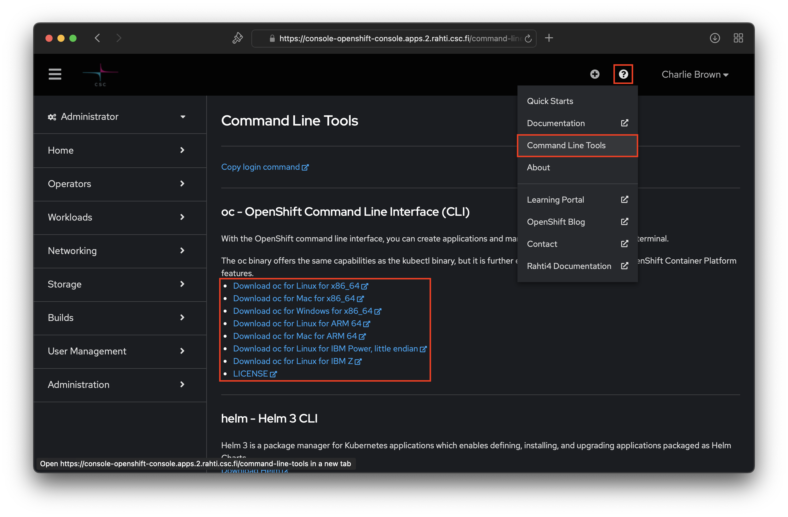

# Komentorivityökalun asennus ja käyttö

## Openshift-komentorivityökalun asennus

Red Hat tarjoaa työkalun nimeltään `oc` OpenShift ympäristön hallintaan komentoriviltä käsin. Linkki `oc`-työkalun lataamiseen löytyy Rahti-palvelun hallintanäkymästä.



Linkistä avautuvalta sivustolta voi ladata omalle käyttöjärjestelmälle soveltuvan version. Linkeistä latautuu yksittäinen, suoritettava tiedosto nimeltään `oc`. Kyseisen tiedoston tulee löytyä käyttöjärjestelmän polusta (esim. Windows-ympäristön `PATH`-muuttujan määrittämässä sijainnissa) tai sen Spring-sovelluksen hakemistosta, mistä komentoja suoritetaan.

Jatkossa oletetaan, että `oc`-työkalu on asennettu polkuun. 

### Asennus Windows-ympäristössä

Kopioi `oc.exe` johonkin hakemistoon koneellasi (esimerkissä `c:\openshift\CLI`) ja lisää hakemisto polkuun.

```powershell
$Path = [Environment]::GetEnvironmentVariable("PATH", "User") + [IO.Path]::PathSeparator + "C:\openshift\CLI"
[Environment]::SetEnvironmentVariable( "Path", $Path, "User" )
```

## Rahti-palveluun kirjautuminen komentorivillä

Jotta `oc`-komentoja voi antaa, on kirjauduttava Rahti-palveluun komentorivin kautta. 

Kirjautumiskomennon saa web käyttöliittymänäkymän oikeasta yläkulmasta _oma nimi_ ja sen alta avautuvasta valikosta _Copy Login Command_.


Turvallisuussyistä Rahti-palvelu pyytää käyttäjää kirjautumaan palveluun uudelleen.

Uudelleenkirjautumisen jälkeen, klikkaa 'Display Token' linkkiä ja liitä komento leikepöydältä paikallisen koneesi komentoriville ja suorita se projektin juurihakemistossa.  

Huom! Jos `oc`-komento ei ole polussa, voi olla tarpeen antaa komennonlle myös polku, esim.
```bash
./oc login https://api.2.rahti.csc.fi:6443 -token=...
```
