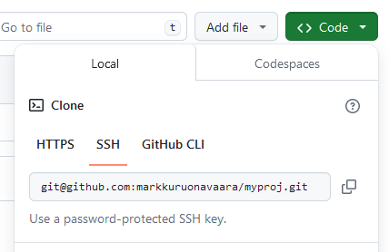

# Spring Boot -palvelimen julkaisu ilman ulkoista tietokantaa

Seuraavassa käydään läpi Spring Boot -palvelimen julkaisu ilman ulkoista tietokantaa.

Tietokannan konfigurointi käsitellään seuraavassa luvussa.

__Huom!__ Jotta tässä luvussa käytettäviä `oc`-komentoja voi antaa, on ensin kirjauduttava Rahti-palveluun luvun [Rahti-palveluun kirjautuminen komentorivillä](komentorivityokalun_asennus.md#rahti-palveluun-kirjautuminen-komentorivilla) ohjeiden mukaisesti.

Kirjaudu ensin Rahti-palveluun komentorivillä ja aseta luomasi projekti aktiiviseksi.

```bash
oc project myproject
```

## Sovelluksen luonti

Rahti-palvelun työkaluilla voidaan luoda sovelluksen julkaisuun tarvittavat resurssit repositorion sisällön perusteella automaattisesti. Resurssit voidaan luoda joko suoraan lähdekoodin perusteella (_Source-to-Image_, _S2I_) tai projektissa määritetyn Dockerfile:n perusteella. 

Uusi sovellus voidaan luoda komentorivikomennolla `oc new-app`. Komennolle annetaan parametrina repositorio-osoite, josta projekti käydään hakemassa. 

### Sovellusprojektin sijainti repositoriossa

Build-työkalut olettavat, että sovellusprojekti sijaitsee repositorion juurihakemistossa. Jos näin ei ole, voidaan projektihakemisto antaa `oc new-app`-komennossa valitsinparametrilla `--context-dir`:

```bash
--context-dir=<projektihakemisto>
```
- `<projektihakemisto>` on suhteellinen polku repositorion juuresta siihen hakemistoon, jossa sovellusprojekti sijaitsee, esim. `--context-dir=myproj`. 

### Repositorio-oikeudet

Rahti-työkalut tarvitsevat pääsyn projektin repositorioon. Jos repositorio on julkinen, ei pääsyoikeuksia tarvitse erikseen määrittää.

Jos repositorio on yksityinen, on Rahti-projektille järjestettävä pääsy luvun [Julkaisu yksityisestä GitHub-repositoriosta](julkaisu_yksityisesta_repositoriosta.md) ohjeiden mukaisesti, ja annettavissa komennoissa on lisäksi annettava  tieto tarvittavasta SSH-avaimesta valitsimella 

```bash
--source-secret=<github-creds-secret-name>
```

- `<github-creds-secret-name>` on salaisuus, joka sisältää yksityisen SSH-avaimen.

Tässä tapauksessa repositorion osoite pitää antaa SSH-muodossa, esim:

```bash
git@github.com:<user>/<repositorionimi>.git
```


### Sovelluksen luontikomennot

Seuraavissa esimerkeissä käydään läpi sovelluksen luonti molemmilla edellä mainituilla tavoilla. Kaikki komennot tehdään komentoriviltä. 

=== "Dockerfilen perusteella"

    Lisää Spring Boot projektin juureen tiedosto `Dockerfile`, jonka sisältö on seuraava:

    ```dockerfile
    FROM eclipse-temurin:17-jdk-focal as builder
    WORKDIR /opt/app
    COPY .mvn/ .mvn
    COPY mvnw pom.xml ./
    RUN chmod +x ./mvnw
    RUN ./mvnw dependency:go-offline
    COPY ./src ./src
    RUN ./mvnw clean install -DskipTests 
    RUN find ./target -type f -name '*.jar' -exec cp {} /opt/app/app.jar \; -quit

    FROM eclipse-temurin:17-jre-alpine
    COPY --from=builder /opt/app/*.jar /opt/app/
    EXPOSE 8080
    ENTRYPOINT ["java", "-jar", "/opt/app/app.jar" ]
    ``` 
    Määritys on laadittu yleiskäyttöiseksi, sen pitäisi toimia missä tahansa Spring Boot -projektissa sellaisenaan.

    Jos repositorio on julkinen, voit luoda projektiin sovelluksen (_application_) komennolla:
    ```bash
    oc new-app <repository-URL>#<branch-name>
    ```
    - `<repository-URL>` on osoite, josta repositorion voi kloonata
    - `<branch-name>` on haara, josta julkaistaan.

    Jos repositorio on yksityinen, on komentoon lisättävä tieto käytettävästä SSH-avaimesta:

    ```bash
    oc new-app <repository-URL>#<branch-name> --source-secret=<github-creds-secret-name>
    ```

=== "Source-to-Image-työkaluilla"

    Jos repositorio on julkinen, voit luoda projektiin sovelluksen (_application_) komennolla:

    ```
    oc new-app registry.access.redhat.com/ubi8/openjdk-17:1.18-2~<repository-URL>#<branch-name>
    ```
    - `registry.access.redhat.com/ubi8/openjdk-17:1.18-2` on S2I-työkalulevykuva Java 17-sovelluksille
    - `<repositorio-URL>` on osoite, josta repositorion voi kloonata
    - `<branch-name>` on haara, josta julkaistaan.

    Jos repositorio on yksityinen, on komentoon lisättävä tieto käytettävästä SSH-avaimesta:
    ```
    oc new-app registry.access.redhat.com/ubi8/openjdk-17:1.18-2~<repository-URL>#<branch-name> --source-secret=<github-creds-secret-name>
    ```

Komennon tuloksena syntyy _build config_ ja build käynnistyy. Voit seurata buildin etenemistä web-käyttöliittymässä.

Kun julkaisu on onnistunut, projektiin on ilmaantunut deployment-konfiguraatio (_deployment configuration_), palvelu (_service_) sekä toivottavasti käynnissä oleva kontti. Jos näin ei ole, tilannetta voi selvitellä luvun [Virheenjäljitys](virheenjaljitys.md) ohjeiden avulla.

Tämän jälkeen on vielä avattava palvelulle reitti (_route_), jolla palveluun pääsee internetistä. Sen voi tehdä komennolla:

```bash
oc expose service <service-name>
```
- `<service-name>` on äsken luodun palvelun nimi, oletusarvoisesti sama kuin sovelluksen nimi. Sovelluksen palvelut voi katsoa web-käyttöliittymästä tai listata komennolla `oc get svc`.

Oletusarvoisesti luodaan salaamaton http-reitti. Jos halutaan https-pääsy, on se konfiguroitava erikseen, ks. luku [HTTPS-konfigurointi](#https-konfigurointi)

## Buildin käynnistäminen

Julkaisun jälkeen uusi julkaisu voidaan käynnistää manuaalisesti web-käyttöliittymästä tai komentorivillä `oc`-komennolla.  
```bash
oc start-build <build-config-name>
```
- `<build-config-name>` on oletusarvoisesti sama kuin `<deployment-config-name>`

Build voidaan myös automatisoida tapahtumaan aina, kun GitHub-repositorioon pusketaan uusi versio lähdekoodista
